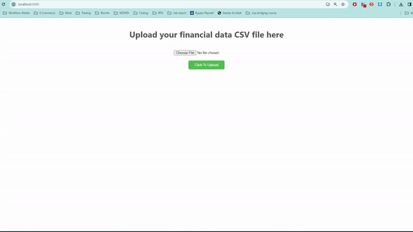

# Project Overview:
`Objective`: Create a web application where users can upload a CSV file with financial data, and
the application will display charts (e.g., pie, bar charts) based on the uploaded data.

## Charts displayed
1. `Monthly Expenditure Over Time`: To see how the total expenditure has changed month by month over the 5 years.
2. `Average Spend by Category:` To understand which categories have the highest average spending.
3. `Total Spend by Category Over the 5 Years`: To see which categories have the highest total expenditure over the 5-year period.

# WebApp Architecture
```
CVPD_interview/
│
├── backend/
│   └── src/ 
│       └── app.py # Contains all backend flask endpoints
│   └── uploads/ # uploaded csv file will be stored here
│   └── output/ # generated graphs will be stored here 
│   └── requirement.txt
│
├── frontend/
│   └── src/
│       └── app.js # Main js entry point for the React application
│       └── FileUploadComponent.js # This component provides an interface for users to upload CSV files
│       └── ViewChartsComponent.js # This component is responsible for visualizing the charts
│       ...
│   └── public/ 
│   └── node_modules/ 
│   └── package.json/ 
│   └── package-lock.json/
└── readme.md
```

# Setting up
## Backend set up
```
# in powershell
# cd to desired backend folder
cd .\backend\

# Create python virtual env
python -m venv backend_env

# Activate py env
backend_env/Scripts/Activate.ps1

pip install -r requirement.txt
```

## Frontend set up
```
# in powershell
cd .\frontend\

npm install react-router-dom
npm install axios
```
# How to run web application
```
# run backend
cd ./backend/src/

python app.py
```
Flask app is running on local host `http://127.0.0.1:5000`.

```
# run frontend
npm start
```
React web application is running on local host `http://localhost:3000`. Ensure that the Flask app is running together with react application.

## Website Demo


# Code walk through
# 1. Backend (app.py)

This Flask web application serves several purposes: 
- It allows users to upload CSV files. 
- Processes these files to generate visual charts (graphs). 
- Serves these charts back to the user. 
- The application is structured to handle file uploads securely, validate the structure of the uploaded CSV, generate charts based on the CSV data, and finally, allow the retrieval of these charts.

## Initial Setup

- **Flask, CORS, Werkzeug, os, csv, pandas, matplotlib**: These are the imported libraries. Flask is used for the web server, CORS for cross-origin requests, Werkzeug for securing filenames, os for operating system interactions, csv for CSV file reading, pandas for data manipulation, and matplotlib for chart generation.
- **plt.switch_backend("agg")**: This changes Matplotlib's backend to 'agg', which is a non-GUI backend suitable for script and server environments.
- **Flask app and CORS setup**: Initializes the Flask app and applies Cross-Origin Resource Sharing (CORS) policies to allow requests from different origins.

## Configuration

- **PARENT_PATH, UPLOAD_FOLDER**: Defines paths used to store uploaded files and generated charts. `PARENT_PATH` is the parent directory of the current working directory, and `UPLOAD_FOLDER` is a subdirectory for uploads.
- **ALLOWED_EXTENSIONS, ALLOWED_MIME_TYPES**: Sets the allowed file extensions and MIME types for the uploads, focusing on CSV files.

## Helper Functions

- **allowed_file(filename)**: Validates if the uploaded file has an allowed extension.
- **validate_csv_structure(row)**: Checks if the uploaded CSV file contains the expected columns.
- **process_csv(filename, chart_name)**: Reads the uploaded CSV, processes the data according to the specified chart type, and returns a DataFrame suitable for chart generation.
- **generate_chart(processed_data, chart_name)**: Takes the processed DataFrame and generates a chart, saving it to the 'output' folder as a JPEG image.

## Flask Routes

- **@app.route("/upload", methods=["POST"])**: Handles file uploads. It performs checks to ensure a file is included in the request, validates the file type, and saves the file. It then opens the CSV to check its structure.
- **@app.route("/process-and-chart/<chart_name>", methods=["GET"])**: Triggers the processing of the uploaded CSV file into a specified chart type. It looks for a specific CSV file (`5_years_financial_data.csv`), processes the data, generates a chart, and saves the chart image.
- **@app.route("/charts/<chart_name>", methods=["GET"])**: Serves the generated chart images. It checks if the requested chart image exists and returns it, or returns an error if not found.

## Main Functionality

- **CSV Upload and Validation**: Users can upload CSV files, which are then validated for structure and content.
- **Data Processing and Chart Generation**: The application processes uploaded CSV files based on predefined chart types ('monthly_expenditure_over_time.jpg', 'average_spend_by_category.jpg', and 'total_spend_by_category_over_5_years.jpg'), generating corresponding charts using matplotlib.
- **Chart Retrieval**: Users can retrieve and view the generated charts by accessing a specific URL endpoint for each chart.

## Security and Error Handling

- The application includes basic security measures like MIME type validation and filename sanitization to protect against common vulnerabilities such as malicious file uploads.
- Error handling is incorporated to provide feedback on failed operations, such as unsupported file types, incorrect CSV structures, or when requested charts are not found.

# 2. Frontend (React)
## 2.1 App.js
The `App` component serves as the root component of a React application that features a simple file upload functionality and a subsequent chart viewing page. This document outlines the structure and functionality of the `App` component, focusing on its use of React Router for navigation.

### Component Structure
```
import React from 'react';
import { BrowserRouter as Router, Routes, Route } from 'react-router-dom';
import FileUploadComponent from './FileUploadComponent';
import ViewChartsComponent from './ViewChartsComponent';
```
- **React**: Base React library import.
- **BrowserRouter as Router, Routes, Route**: Imports from react-router-dom necessary for configuring the application's client-side routing.
- **FileUploadComponent**: A component that provides an interface for users to upload files.
- **ViewChartsComponent**: A component that displays charts based on the uploaded data.
```
function App() {
  return (
    <Router>
      <Routes>
        <Route path="/" element={<FileUploadComponent />} />
        <Route path="/view-charts/:chartName" element={<ViewChartsComponent />} />
      </Routes>
    </Router>
  );
}

```
- **Router (BrowserRouter)**: Wraps the routing configuration, enabling HTML5 history API for navigation without page refreshes.
- **Routes**: A container for all the Route components, representing different paths in the application.
- **Route**: Defines a path and the component to render when the application's URL matches that path.
- **path="/"**: The root path of the application, associated with the `FileUploadComponent`. This is the default entry point where users can upload files.
- **path="/view-charts/:chartName"**: A parameterized route for viewing charts. :chartName acts as a URL parameter that the `ViewChartsComponent` can access to determine which chart to display.

## 2.2 FileUploadComponent.js
The `FileUploadComponent` is a React component designed for uploading financial data in CSV format, processing it to generate visual charts, and navigating to view these charts. This component utilizes hooks for state management, Axios for HTTP requests, and React Router for navigation.

### Component Structure
- **React**: Importing React and the useState hook for component state management.
- **Axios**: Used for making HTTP requests to the backend server.
- **useNavigate**: Hook from react-router-dom for programmatically navigating between components.

### State Management
```
const [file, setFile] = useState(null);
const [message, setMessage] = useState('');
const [uploadSuccess, setUploadSuccess] = useState(false);
```

- `file`: Holds the file object selected by the user.
- `message`: Stores messages to display to the user (e.g., success or error messages).
- `uploadSuccess`: Boolean flag indicating whether the file upload was successful.

### File Selection
```
const handleFileChange = (event) => {
    setFile(event.target.files[0]);
};

```
- Captures the selected file from the file input element and updates the file state.

### File Upload
```
const handleUpload = async () => {
    const formData = new FormData();
    formData.append('file', file);

    try {
        const response = await axios.post('http://localhost:5000/upload', formData);
        setMessage(response.data.message);
        setUploadSuccess(true); // Update upload success state
    } catch (error) {
        setMessage(error.response ? error.response.data.error : 'An unexpected error occurred');
        setUploadSuccess(false);
    }
};
```
- Asynchronously uploads the file to the server using Axios.
- Updates the user message and uploadSuccess state based on the outcome.

### Chart Processing
```
const processChart = async (chartName) => {
    try {
        await axios.get(`http://localhost:5000/process-and-chart/${chartName}`);
        // Navigate to view the chart
        navigate(`/view-charts/${chartName}`);
    } catch (error) {
        setMessage('Error processing chart:', error);
    }
};
```
- Triggers backend processing of the uploaded CSV to generate a specified chart.
- Navigates to the component for viewing the generated chart upon success.

### Rendering 
```
return (
    <div style={{ display: 'flex', flexDirection: 'column', alignItems: 'center', marginTop: '20px' }}>
        ...
    </div>
);

```
- Renders the file upload interface.
- Displays buttons for generating charts upon successful upload.
- Utilizes inline styling for layout and aesthetics.

### Styling
```
const buttonStyle = {
    ...
};
```
- Defines a constant for common button styling to ensure a consistent look and feel.

# 2.3 ViewChartsComponent.js
The `ViewChartsComponent` is a React component responsible for displaying charts generated from financial data. It allows users to view a selected chart and provides options to process and view additional charts.

### Component Structure
- **React**: Importing React and the useState hook for component state management.
- **Axios**: Used for making HTTP requests to the backend server.
- **useParams, useNavigate**: Hooks from react-router-dom to access the URL parameters and programmatically navigate between views.

### Component State 
```
const [message, setMessage] = useState('');
```
- `message`: A state variable to store feedback messages (e.g., error messages) to display to the user.
### URL Parameters and Navigation
```
const { chartName } = useParams();
const navigate = useNavigate();
```
- `chartName`: Retrieves the chart name from the URL parameter, indicating which chart to display.
- `navigate`: Enables programmatic navigation to other routes within the application.
### Image URL Construction
```
const imageUrl = `http://localhost:5000/charts/${chartName}`;
```
- Constructs the URL to the chart image based on the `chartName` parameter.
### Processing Charts
```
const processChart = async (chartName) => {
    try {
        await axios.get(`http://localhost:5000/process-and-chart/${chartName}`);
        navigate(`/view-charts/${chartName}`);
    } catch (error) {
        setMessage('Error processing chart:', error);
    }
};

```
- An asynchronous function that makes a GET request to the backend to trigger chart processing.
- Navigates to the view of the newly processed chart.
- Updates the message state with any errors encountered during the process.

### Rendering
```
return (
    <div style={{ textAlign: 'center' }}>
        ...
    </div>
);
```
The component renders:
- A heading displaying the name of the current chart.
- The chart image using an  tag.
- Feedback messages to the user.
- Buttons for triggering the processing of other charts.

### Styling
```
const buttonStyle = {
    ...
};
```
- Defines a constant for common button styling to ensure a consistent look and feel.